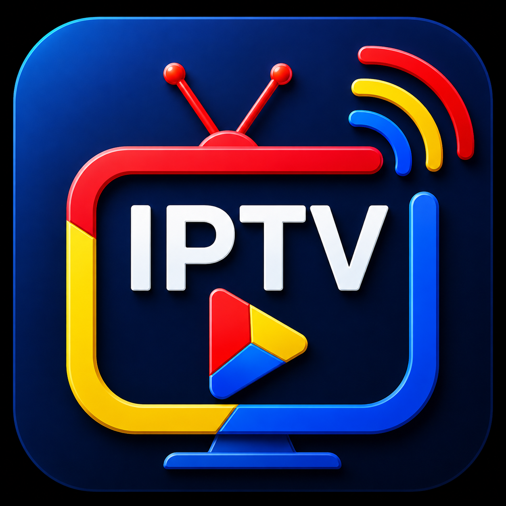

<p align="center">
  
</p>

<h1 align="center">IPTVViewer</h1>

<p align="center"><strong>Tu televisión por Internet, sin complicaciones.</strong></p>

IPTVViewer es un reproductor de televisión por Internet para **Windows** que convierte tus listas IPTV en una experiencia de televisión completa, fluida y privada. Carga tus listas **M3U**, consulta la guía de programación **EPG**, cambia de canal al instante y protege tu conexión con **proxies** — todo desde una sola aplicación ligera y portátil.

---

## Qué hace

- 📺 Reproduce canales en directo desde listas **M3U**.
- 📅 Guía de programación **EPG (XMLTV)** integrada, con parrilla de canales.
- 🔀 **Zapping** instantáneo: cambia de canal con las flechas.
- 🖼️ Logos de canales y avisos en pantalla.
- ⚡ **Aceleración por hardware** para un vídeo fluido.
- 🖥️ **Modos de visualización** flexibles (normal, compacto, vídeo y ventana flotante).
- 🛡️ Soporte de **proxies** (HTTP, SOCKS y Tor) para privacidad y acceso.
- 🔄 Aviso de **nuevas versiones** disponibles.
- 🚀 **Portátil**: no requiere permisos de administrador.

---

## Motores de reproducción

IPTVViewer incluye **tres motores** para que elijas el que mejor se adapta a tu equipo:

| Motor | Ideal para | Descarga |
|-------|-----------|----------|
| **mpv** | Máxima compatibilidad | Automática |
| **mpv (AVX2)** | Procesadores modernos, más rendimiento | Automática |
| **VLC** | Compatibilidad total y proxy SOCKS/Tor | Automática |

- **mpv** — funciona en prácticamente cualquier equipo.
- **mpv (AVX2)** — aprovecha las instrucciones AVX2 de las CPUs modernas para un extra de rendimiento.
- **VLC** — el clásico, ideal si reproduces a través de un proxy SOCKS o Tor.

> **Sin configuración manual.** La primera vez que arranques, IPTVViewer descarga automáticamente el motor que necesites.

---

## Privacidad y proxies

¿Quieres ver la televisión a través de un proxy o de la red Tor? IPTVViewer lo soporta:

- **HTTP / HTTPS**
- **SOCKS4 / SOCKS5**
- **Tor** — con verificación automática de que tu tráfico sale realmente por la red Tor.

Configura el proxy en unos segundos desde el menú **Red → Proxy**.

---

## Modos de visualización

Adapta la ventana a lo que estés viendo en cada momento:

| Modo | Qué hace |
|------|----------|
| **Normal** | Lista de canales + reproductor, la vista completa. |
| **Compacto** | Interfaz reducida para ocupar menos espacio. |
| **Vídeo** | Solo el vídeo, sin distracciones. |
| **PIP** | Ventana flotante siempre visible, para ver la TV mientras haces otras cosas. |

---

## Atajos de teclado

| Tecla | Acción |
|-------|--------|
| `Alt+1` | Modo Normal |
| `Alt+2` | Modo Compacto |
| `Alt+3` | Modo Vídeo |
| `Alt+4` / `P` | Ventana PIP |
| `F` | Pantalla completa |
| `Esc` | Salir de pantalla completa |
| `↑` / `↓` | Canal anterior / siguiente |
| `Ctrl+G` | Parrilla EPG |

---

## Cómo configurar tus listas

Puedes tener varias listas (por ejemplo, una de canales españoles y otra de Pluto TV) y cambiar entre ellas cuando quieras.

Desde el menú **Listas** puedes **añadir**, **editar** o **eliminar** listas. Cada lista se compone de:

| Campo | Descripción |
|-------|-------------|
| **Nombre** | El nombre que verás en la app. |
| **M3U** | La URL de tu lista de canales. |
| **Filtro** | Filtra los canales por grupo (opcional). |
| **EPG** | La URL de la guía de programación XMLTV (opcional). |

Las listas se guardan en `config.ini`. Ejemplo:

```ini
[source.0]
name = TV España
m3u = http://TU_SERVIDOR/m3u/xteve.m3u
filter = SPAIN
epg = http://TU_SERVIDOR/xmltv/xteve.xml
```

---

## Instalación

1. Ve a la página de **[Releases](https://github.com/killo3967/IPTVViewer/releases)**.
2. Descarga el **instalador** (`IPTVViewer-Setup-*.exe`) o el **ejecutable portátil** (`IPTVViewer.exe`).
3. Ejecútalo y listo. Sin dependencias: los motores se descargan solos en el primer arranque.

---

## Documentación técnica

¿Eres desarrollador o quieres profundizar? La documentación técnica está organizada según el framework **Diataxis** en [`docs/diataxis/`](docs/diataxis/index.md): arquitectura, entorno de desarrollo, operaciones, referencia de configuración y dependencias.

---

## Licencia

[MIT](LICENSE) · Copyright (c) 2026 killo3967
