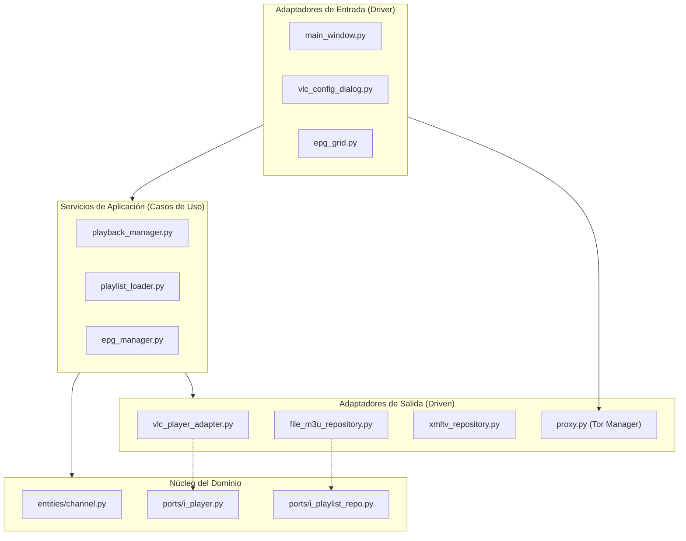

# Arquitectura del Sistema (IPTV Viewer)

Este proyecto está diseñado siguiendo una **Arquitectura Hexagonal (Puertos y Adaptadores)**, lo que separa la lógica de negocio (Dominio) de los detalles técnicos (Infraestructura).

## Estructura de Capas

## Responsabilidades por Carpeta

*   **`src/domain`**: Contiene las entidades de negocio (`Channel`, `Playlist`, `EPG`) y las interfaces (`ports`) que definen cómo el sistema interactúa con el mundo exterior.
*   **`src/application`**: Implementa la lógica de orquestación. Los servicios (`services`) coordinan el flujo de datos entre la UI y los adaptadores.
*   **`src/infrastructure`**: 
    *   **`adapters`**: Implementaciones concretas de los puertos de salida (VLC, Repositorios M3U/XML) y el **TorpyProxyManager** para navegación anónima.
    *   **`ui`**: Capa de presentación desarrollada en **PyQt6**, incluyendo el diálogo de configuración de proxy con monitoreo en tiempo real.

## Ciclo de Vida del Dato (Reproducción)

1. El usuario selecciona un canal en `IPTVMainWindow`.
2. Se llama a `PlaybackManager.play_channel()`.
3. `PlaybackManager` coordina al `IPlayer` (puerto).
4. El adaptador `VlcPlayerAdapter` (infraestructura) ejecuta la orden en la librería VLC.
5. Si falla el stream, `VlcPlayerAdapter` activa su **sistema de autorreconexión por eventos**.

## Gestión de Proxy y Tor

El sistema implementa un nodo interno de Tor (`torpy`) que actúa como un túnel para todo el tráfico de la aplicación:
1. Al activar Tor, se inicia un hilo secundario que negocia un circuito de 3 saltos.
2. Una vez "ready", se configuran las variables de entorno (`HTTP_PROXY`, `HTTPS_PROXY`) y el `QNetworkProxy` de aplicación.
3. El motor de vídeo (VLC/MPV) hereda estas variables, permitiendo la reproducción anónima de streams.
