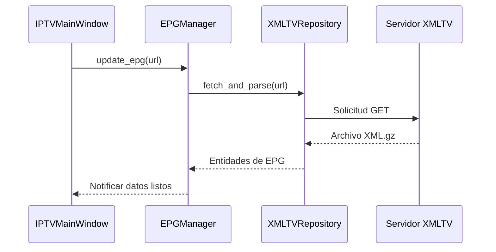
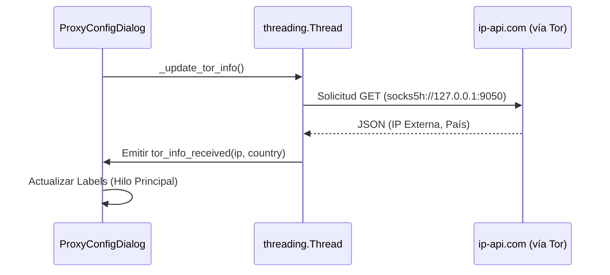

# Operaciones y Mantenimiento (IPTV Viewer)

Este documento detalla el mantenimiento diario, la resolución de problemas y el sistema de logging.

## Flujos de Datos Críticos

### 1. Carga de Grilla (EPG)

### 2. Monitoreo de Red Tor

## Sistema de Logging

El proyecto utiliza un sistema de logs triple:
1.  **`logs/iptv_viewer.log`**: Registro general de la aplicación (errores de red, eventos de usuario, cambios de configuración).
2.  **`logs/vlc.log`**: Registro de bajo nivel generado por el motor VLC.
3.  **`logs/mpv.log`**: Registro de bajo nivel generado por el motor mpv (ffmpeg/libmpv).

Ambos motores permiten configurar su nivel de detalle (desde error hasta trace/debug) desde el panel de **Configuración del Reproductor**.

## Resolución de Problemas (Troubleshooting)

### Pantalla Negra / Buffering constante
*   **Causa**: Micro-cortes en la fuente de IPTV.
*   **Solución**: Aumentar el **Caché de red** en la configuración técnica de VLC (ej. 5000ms a 10000ms).

### Tirones / Desincronización Audio-Vídeo
*   **Causa**: Sobrecarga del decodificador por múltiples hilos o aceleración hardware inestable.
*   **Solución**: Desactivar **Aceleración por Hardware** y establecer **Sincro reloj (0/1)** a `0`. El sistema ya está optimizado para usar un solo hilo de decodificación en cortes de red.

## Sistema de Pruebas

El proyecto cuenta con un laboratorio de experimentos en el directorio `/pruebas/`:
*   `channel_test.py`: Verificador multihilo de canales IPTV.
*   `test_mpv.py`: Script para validar la carga de la DLL de mpv y su integración con Python.
*   `vlc_check.py`: Verificación de la instalación correcta de los bindings de VLC.
