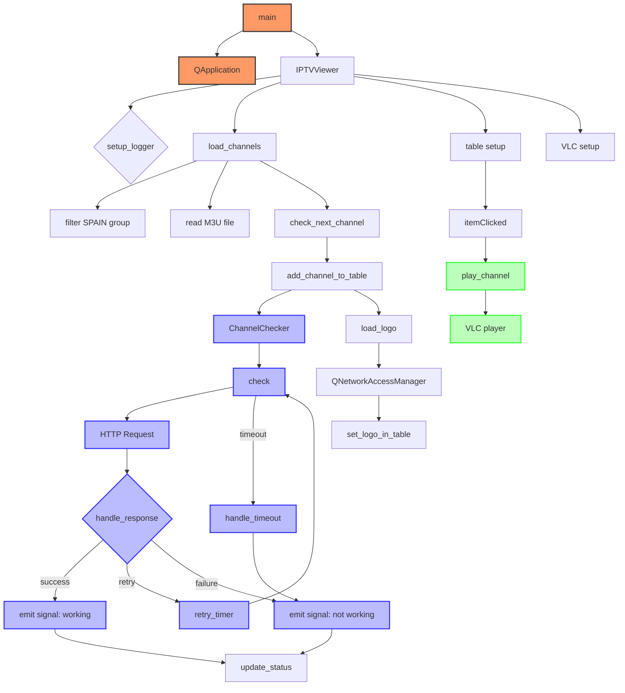

```mermaid
graph TD
    A[main] --> B[QApplication]
    A --> C[IPTVViewer]
    
    %% Clase IPTVViewer
    C --> D{setup_logger}
    C --> E[load_channels]
    C --> F[table setup]
    C --> G[VLC setup]
    
    E --> E1[filter SPAIN group]
    E --> E2[read M3U file]
    E --> E3[check_next_channel]
    E3 --> E4[add_channel_to_table]
    
    %% Proceso de verificación
    E4 --> CH[ChannelChecker]
    CH --> CH1[check]
    CH1 --> CH2[HTTP Request]
    CH2 --> CH3{handle_response}
    CH3 --> |success| CH4[emit signal: working]
    CH3 --> |retry| CH5[retry_timer]
    CH5 --> CH1
    CH3 --> |failure| CH6[emit signal: not working]
    
    %% Timeout handler
    CH1 --> |timeout| CH7[handle_timeout]
    CH7 --> CH6
    
    %% Signal update
    CH4 --> UI1[update_status]
    CH6 --> UI1
    
    %% User interaction
    F --> UI2[itemClicked]
    UI2 --> P1[play_channel]
    P1 --> P2[VLC player]
    
    %% Manejo de logos
    E4 --> L1[load_logo]
    L1 --> L2[QNetworkAccessManager]
    L2 --> L3[set_logo_in_table]
    
    classDef mainClass fill:#f96,stroke:#333,stroke-width:2px;
    classDef checkerClass fill:#bbf,stroke:#33f,stroke-width:2px;
    classDef playerClass fill:#bfb,stroke:#3f3,stroke-width:2px;
    
    class A,B mainClass;
    class CH,CH1,CH2,CH3,CH4,CH5,CH6,CH7 checkerClass;
    class P1,P2 playerClass;
```
