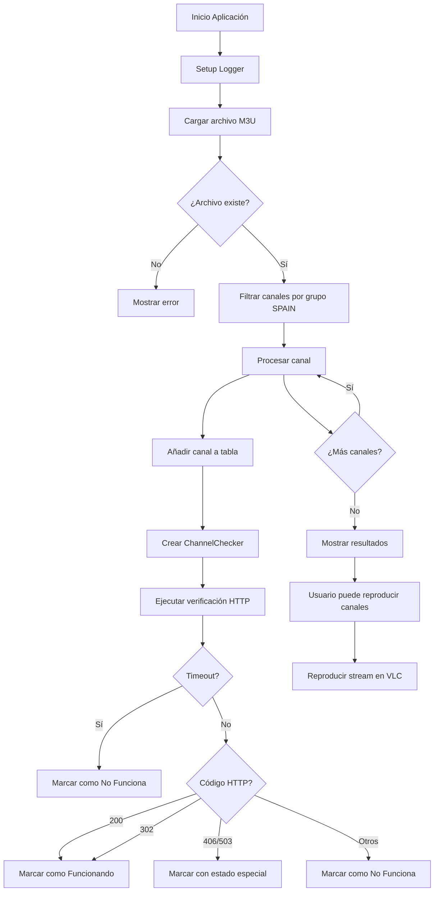

```mermaid
graph TD
    A[Inicio Aplicación] --> B[Setup Logger]
    B --> C[Cargar archivo M3U]
    C --> D{¿Archivo existe?}
    D -->|No| E[Mostrar error]
    D -->|Sí| F[Filtrar canales por grupo SPAIN]
    
    F --> G[Procesar canal]
    G --> H[Añadir canal a tabla]
    H --> I[Crear ChannelChecker]
    I --> J[Ejecutar verificación HTTP]
    
    J --> K{Timeout?}
    K -->|Sí| L[Marcar como No Funciona]
    
    K -->|No| M{Código HTTP?}
    M -->|200| N[Marcar como Funcionando]
    M -->|302| N
    M -->|406/503| O[Marcar con estado especial]
    M -->|Otros| P[Marcar como No Funciona]
    
    G --> Q{¿Más canales?}
    Q -->|Sí| G
    Q -->|No| R[Mostrar resultados]
    
    R --> S[Usuario puede reproducir canales]
    S --> T[Reproducir stream en VLC]
```
