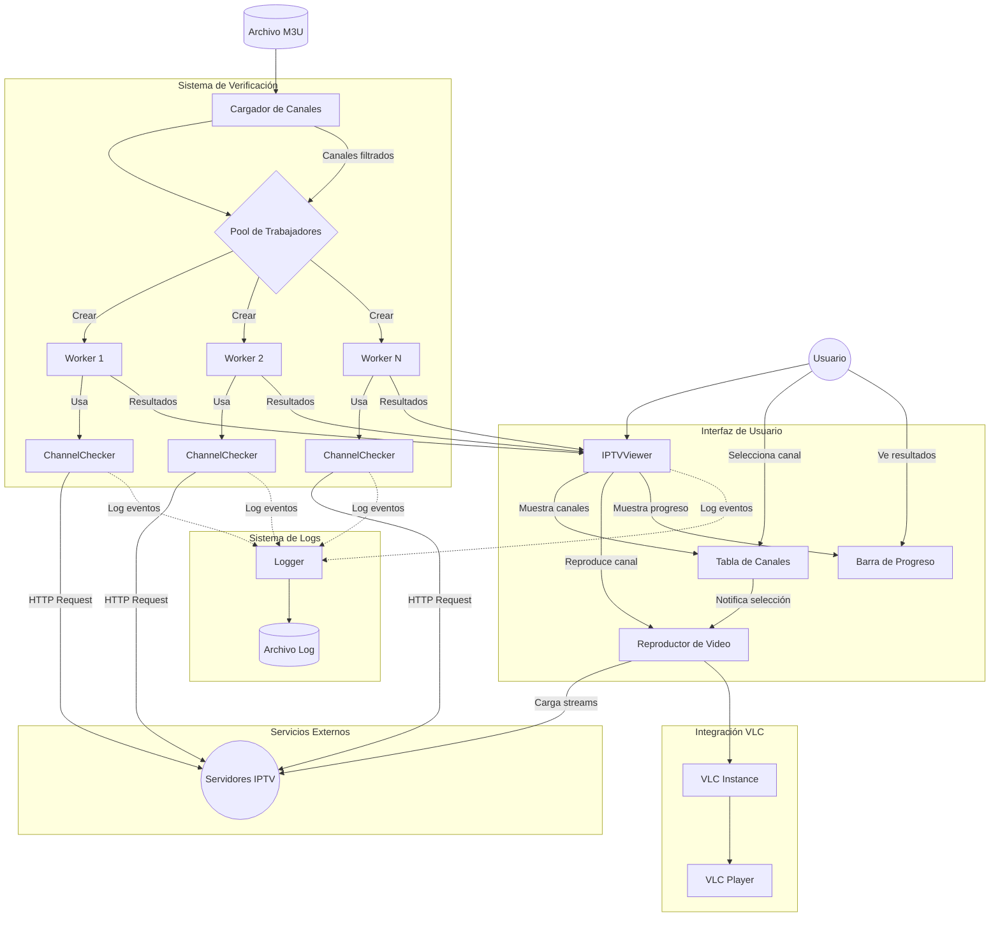

```mermaid
graph TD
    %% Usuarios y entradas externas
    User((Usuario)) --> UI
    M3UFile[(Archivo M3U)] --> DataLoader
    
    %% Componentes principales de la aplicación
    subgraph Interfaz de Usuario
        UI[IPTVViewer] --> |Muestra canales| ChannelTable[Tabla de Canales]
        UI --> |Reproduce canal| VideoPlayer[Reproductor de Video]
        UI --> |Muestra progreso| ProgressBar[Barra de Progreso]
    end
    
    subgraph Sistema de Verificación
        DataLoader[Cargador de Canales] --> WorkerPool{Pool de Trabajadores}
        WorkerPool --> |Crear| Worker1[Worker 1]
        WorkerPool --> |Crear| Worker2[Worker 2]
        WorkerPool --> |Crear| WorkerN[Worker N]
        
        Worker1 --> |Usa| Checker1[ChannelChecker]
        Worker2 --> |Usa| Checker2[ChannelChecker]
        WorkerN --> |Usa| CheckerN[ChannelChecker]
    end
    
    subgraph Servicios Externos
        Checker1 --> |HTTP Request| Server((Servidores IPTV))
        Checker2 --> |HTTP Request| Server
        CheckerN --> |HTTP Request| Server
        VideoPlayer --> |Carga streams| Server
    end
    
    %% Flujo de datos
    DataLoader --> |Canales filtrados| WorkerPool
    Worker1 --> |Resultados| UI
    Worker2 --> |Resultados| UI
    WorkerN --> |Resultados| UI
    
    %% Integración con VLC
    subgraph Integración VLC
        VideoPlayer --> VLCInstance[VLC Instance]
        VLCInstance --> VLCPlayer[VLC Player]
    end
    
    %% Logging
    subgraph Sistema de Logs
        Logger[Logger] --> LogFile[(Archivo Log)]
        Checker1 -.-> |Log eventos| Logger
        Checker2 -.-> |Log eventos| Logger
        CheckerN -.-> |Log eventos| Logger
        UI -.-> |Log eventos| Logger
    end
    
    %% Interacción del usuario
    User --> |Selecciona canal| ChannelTable
    ChannelTable --> |Notifica selección| VideoPlayer
    User --> |Ve resultados| ProgressBar
```